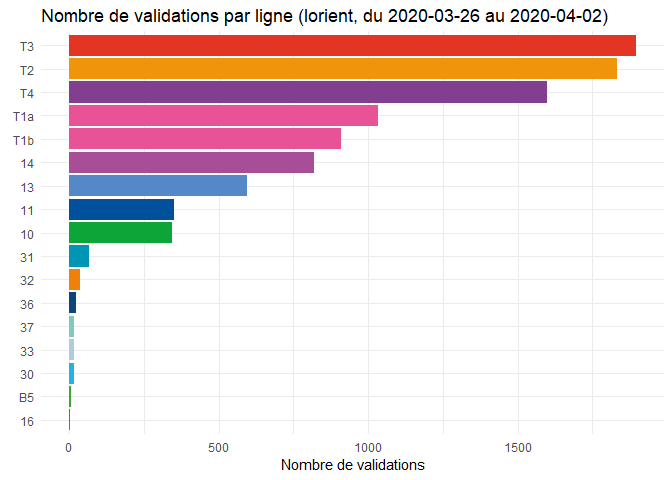

Ticketing per line demo
================
Eglantine Schmitt
04/04/2020

# Log in

``` r
session_id = getSessionId(login, 
                          password, 
                          group, 
                          env)
```

# Retrieve referential information and ticketing data

``` r
api_base_url = buildBaseUrl(group, env)

referential_lines = getReferentialSection(api_base_url,session_id,"lines")

agency_id = getAgencyId(api_base_url, session_id)

ticketing_data = getKPIdata(api_base_url,"ticketing",agency_id, start_date = "2020-03-26", end_date = "2020-04-02",session_id = session_id)
```

# Format and transform data

``` r
ticketing_data = merge(x = ticketing_data, 
                       y = referential_lines,
                       by.x = "aggregation_level_id", 
                       by.y = "id")

lines_colours = referential_lines$colour
names(lines_colours) = referential_lines$name

ticketing_per_line = 
  ticketing_data %>%
  group_by(name) %>%
  summarise(direction_in = sum(direction_in))

head(ticketing_per_line)
```

    ## # A tibble: 6 x 2
    ##   name  direction_in
    ##   <chr>        <int>
    ## 1 10             343
    ## 2 11             351
    ## 3 13             596
    ## 4 14             820
    ## 5 16               2
    ## 6 30              15

# Visualise

<!-- -->
