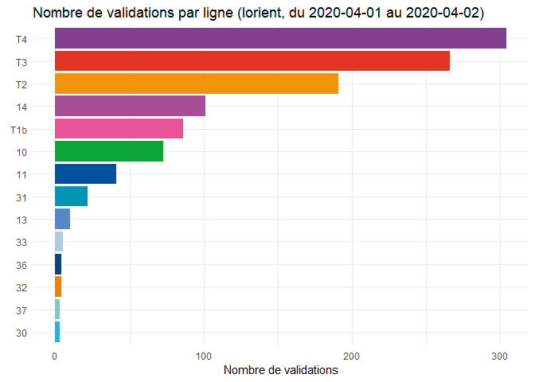

Ticketing per direction demo
================
Eglantine Schmitt
04/04/2020

# Log in

``` r
sessionId = getSessionId(login_route, 
                         auth_route, 
                         credentials)
```

# Retrieve referential information and ticketing data

``` r
lines = getResponseFromRoute(api_url,
                             sessionId,
                             "/rest/lines")

ticketing_raw_data = getResponseFromRoute(api_url,
                                          sessionId,
                                          "/kpis/ticketing/agency/17/line?aggregated_by_time=false&included_date_perimeters=2020-03-26_2020-04-02_1111111&excluded_date_perimeters=&ticket_type_id=all")
```

# Format and transform data

``` r
referential_lines = do.call(rbind.data.frame, c(lines, stringsAsFactors = F))
ticketing_data = do.call(rbind.data.frame, c(ticketing_raw_data$data, stringsAsFactors = F))

ticketing_data = merge(x = ticketing_data, 
                       y = referential_lines,
                       by.x = "aggregation_level_id", 
                       by.y = "id")

lines_colours = unique(ticketing_data$colour)
names(lines_colours) = unique(ticketing_data$name)

ticketing_per_line = 
  ticketing_data %>%
  group_by(name) %>%
  summarise(direction_in = sum(direction_in))

head(ticketing_per_line)
```

    ## # A tibble: 6 x 2
    ##   name  direction_in
    ##   <chr>        <int>
    ## 1 10              73
    ## 2 11              41
    ## 3 13              10
    ## 4 14             101
    ## 5 30               3
    ## 6 31              22

# Visualise

<!-- -->
